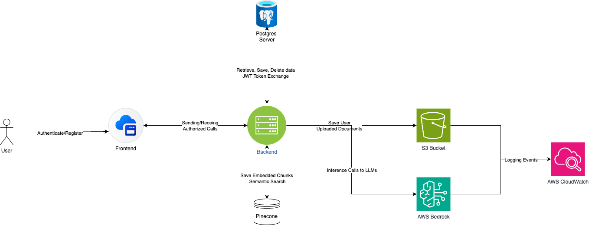

# CustomRAGAssistant

## Overview

CustomRAGAssistant is a secure, full-stack Retrieval-Augmented Generation (RAG) web application that enables users to interact with powerful foundation models from Amazon Bedrock, upload personal documents, and conduct multi-turn conversations grounded in private knowledge. This assistant prioritizes privacy, scalability, and a seamless user experience.

Users can:

- Authenticate securely with JWT-based login/signup
- Upload .pdf, .docx, and txt files
- Run queries using Claude or Titan via Bedrock
- Enable/disable RAG to retrieve context from uploaded documents
- View and manage chat history per session

## Architecture Overview

The system is split into:

- Frontend: Vite + React + Tailwind, manages auth, chat, document upload, and history UI

- Backend: FastAPI + PostgreSQL, handles auth, document processing, RAG with Pinecone, Bedrock inference, and storage

- External Services:
    - Amazon Bedrock: Claude, Titan, Embeddings
    - Amazon S3: Document file storage
    - Pinecone: Vector store for semantic retrieval



### Descriptive Summary:
Upon signing up or logging in, a user is issued JWT tokens for secure access. Users can upload PDF or Word documents, which are parsed, chunked, embedded using Titan Embeddings v2, and stored in Pinecone. Documents are also uploaded to S3 and indexed in PostgreSQL. When the user asks a question, they can toggle RAG to fetch top-k relevant chunks from Pinecone and include them in the Bedrock prompt (Claude or Titan). Multi-turn chat history is stored per user in PostgreSQL.

Key Features:

- Authentication
- JWT-based flow with access & refresh tokens
- Secure password hashing via bcrypt
- Refresh token revocation
- Login, register, refresh, logout, get current user

- Bedrock Model Inference
    - Supports both Claude and Titan
    - Prompts are formatted dynamically based on selected model
    - RAG toggle to optionally inject retrieved document chunks

- Document Upload & Embedding

    - Uploads via S3 with user-level isolation
    - Extracts text from .pdf, .docx, and .txt
    - Chunking using LangChain's RecursiveCharacterTextSplitter
    - Embedding using Titan Embeddings v2
    - Indexes stored in Pinecone under each user namespace

- Chat System
    - Each user can create/delete chat sessions
    - Messages are stored with role (user/assistant)
    - Chat history loaded per session for multi-turn interactions


- Testing
    - pytest test suite with >80% coverage
    - SQLite in-memory test DB
    - Test routes, embedding flow, Pinecone indexing, Bedrock responses

## Project Structure
```
# Front End
src/
├── components/
│   ├── auth/
│   │   ├── LoginForm/
│   │   │   ├── LoginForm.tsx
│   │   │   └── LoginForm.module.css
│   │   └── RegisterForm/
│   │       ├── RegisterForm.tsx
│   │       └── RegisterForm.module.css
│   ├── chat/
│   │   ├── ChatInterface/
│   │   │   ├── ChatInterface.tsx
│   │   │   └── ChatInterface.module.css
│   │   ├── ModelSelector/
│   │   │   ├── ModelSelector.tsx
│   │   │   └── ModelSelector.module.css
│   │   ├── ChatMessage/
│   │   │   ├── ChatMessage.tsx
│   │   │   └── ChatMessage.module.css
│   │   ├── ChatInput/
│   │   │   ├── ChatInput.tsx
│   │   │   └── ChatInput.module.css
│   │   └── RAGToggle/
│   │       ├── RAGToggle.tsx
│   │       └── RAGToggle.module.css
│   ├── layout/
│   │   ├── Navbar/
│   │   │   ├── Navbar.tsx
│   │   │   └── Navbar.module.css
│   │   ├── Sidebar/
│   │   │   ├── Sidebar.tsx
│   │   │   └── Sidebar.module.css
│   │   └── Layout/
│   │       ├── Layout.tsx
│   │       └── Layout.module.css
│   ├── upload/
│   │   └── DocumentUpload/
│   │       ├── DocumentUpload.tsx
│   │       └── DocumentUpload.module.css
│   └── common/
│       ├── Button/
│       │   ├── Button.tsx
│       │   └── Button.module.css
│       ├── Input/
│       │   ├── Input.tsx
│       │   └── Input.module.css
│       └── Modal/
│           ├── Modal.tsx
│           └── Modal.module.css
├── pages/
│   ├── AuthPage/
│   │   ├── AuthPage.tsx
│   │   └── AuthPage.module.css
│   ├── ChatPage/
│   │   ├── ChatPage.tsx
│   │   └── ChatPage.module.css
│   └── UploadPage/
│       ├── UploadPage.tsx
│       └── UploadPage.module.css
├── services/
│   ├── api.ts
│   ├── auth.ts
│   ├── chat.ts
│   └── upload.ts
├── hooks/
│   ├── useAuth.ts
│   ├── useChat.ts
│   └── useLocalStorage.ts
├── context/
│   ├── AuthContext.tsx
│   └── ChatContext.tsx
├── types/
│   ├── auth.ts
│   ├── chat.ts
│   └── api.ts
├── utils/
│   ├── constants.ts
│   ├── helpers.ts
│   └── storage.ts
├── App.tsx
├── main.tsx
└── index.css

# backend
server/
├── app/
│   ├── routes
│       └── auth.py
│       └── inference.py
│       └── sessions.py
│       └── upload.py
│       └── __init__.py
│   ├── services
│       └── bedrock_client.py
│       └── document_processor.py
│       └── embedder.py
│       └── pinecone_client.py
│       └── query_handler.py
│       └── s3_client.py
│       └── __init__.py
│   ├── __init__.py
│   ├── main.py          # FastAPI app entry point
│   ├── database.py      # Database connection
│   ├── models.py        # Database models (tables)
│   ├── schemas.py       # Pydantic models (API input/output)
│   ├── auth.py          # Authentication logic
│   └── config.py        # Configuration settings
├── tests/
├── requirements.txt
├── .env
├── .gitignore           
└── README.md
```

(See full directory layout above)
```server/app/``` - FastAPI backend core logic, routing, services
```client/src/``` - Frontend components, context, hooks, pages
```services/``` - S3, Pinecone, Bedrock, Embedder, Document Processor


## Testing

- Run tests from root directory using:
```pytest``` 

These tests cover >80% of the code and include:
- Happy path tests for all endpoints
- Edge cases for login, refresh expiry, upload errors
- Bedrock mock tests
- Pinecone index test
- S3 upload test

## Deployment Guide

### Prerequisites

- AWS credentials (Bedrock, S3)
- Pinecone API key and environment
- PostgreSQL instance

### Steps

1. Clone repo
2. Set up .env with all required values (model ids, credentials, etc.)
3. Install backend dependencies:
```
cd server
python -m venv venv 
source venv/bin/activate
pip install -r requirements.txt
```

4. Run migrations / create DB tables:

```alembic upgrade head OR use Base.metadata.create_all```

5. Start backend:
```uvicorn app.main:app --reload```

To deploy the actual backend, you can copy the files to an EC2 instance and spin up your own PostGres server. Ensure that the .env point to the appropriate resources

6. Frontend:
```
cd client
npm install
npm run dev
```

## User Manual

- **Register/Login**: Access the app by signing up and logging in.
- **Upload Documents**: Navigate to the Upload page and upload .pdf or .docx.
- **Create Chat Session**: Go to the chat interface and start a new session.
- **Toggle RAG**: Use the toggle to enable/disable document grounding.
- **Ask Questions**: Ask any question. If RAG is enabled, context from uploaded documents will be used.
- **View History**: Sessions and past messages can be browsed and resumed.
